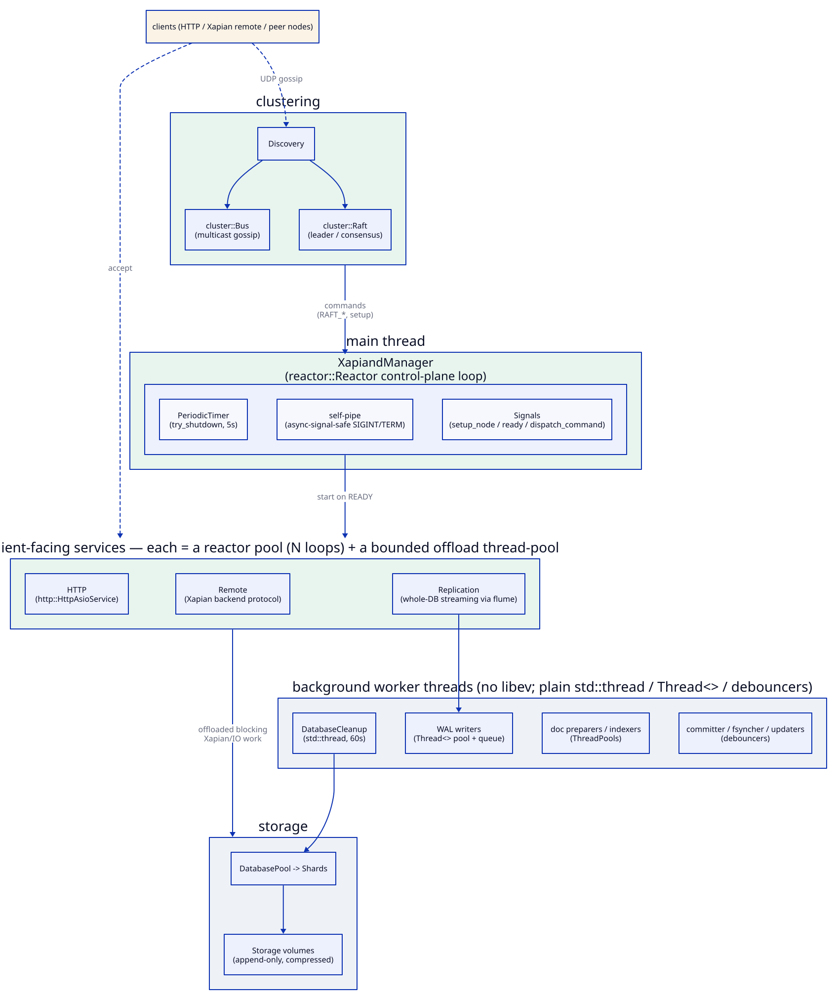

# Xapiand — Architecture

A deep tour of the codebase: how the subsystems fit together, which pieces are
self-contained enough to extract and reuse, and a catalog of the bugs and risks
found while reading the source. Written from a close read of the code; every
claim cites `file:line` so you can check it.

> This document describes Xapiand's *own* code. The `src/` tree still carries a
> small vendored core, chiefly the Xapian fork and libyaml. Most former in-tree
> libraries now arrive through CMake `FetchContent`. See [Code map](#code-map)
> for the split.

---

## Code map

The `src/` tree is much thinner than the pre-extraction snapshot. It now splits
between Xapiand's application code, a customized Xapian fork, and a small YAML
island. The old utility, wire-format, HTTP-parser, compression, and metrics
bundles are pulled by CMake `FetchContent` instead of living under `src/`.

**Bundled / vendored (don't look here for original work):**

| Path | What it is |
|---|---|
| `src/xapian/` | A heavily customized fork of the Xapian search library (the matcher, the glass/honey backends, the weighting schemes). GPL. |
| `src/yaml/` | libyaml plus Xapiand's YAML bridge. |

> The old in-tree copies of `src/cuuid/`, `src/msgpack*`, `src/xchange/`,
> `src/prometheus/`, `src/ev/`, `src/lz4/`, `src/rapidjson/`, `src/cppcodec/`,
> `src/tclap/`, `src/fmt/`, and `src/chaiscript/` are gone. `cuuid`, `msgpack`,
> and the `Kronuz/*` utility stack come through FetchContent; prometheus-cpp core
> comes from upstream v1.2.4, while Xapiand's metric catalog still lives in
> `src/metrics.*`.

**Xapiand's own subsystems:**

| Area | Where | One line |
|---|---|---|
| Storage engine | `src/storage.h`, `src/database/` | Haystack-style append-only volumes, WAL, schema cache, sharding. |
| Networking / reactor runtime | `src/server/`, `http_asio.h`, `src/manager.*` | Per-connection coroutines on shared-nothing `reactor::Reactor` pools; blocking work offloaded to bounded thread-pools. No libev. |
| Clustering | `src/server/discovery.*`, `src/server/replication_protocol_service.*`, `src/server/replication_protocol_views.*`, `src/server/remote_protocol_service.h`, `src/server/remote_protocol_views.*`, `src/manager.*`, `src/node.*` | Raft control plane + asynchronous pull-based data replication. |
| Search / query | `src/query_dsl.*`, `src/booleanParser/`, `src/aggregations/`, `src/multivalue/` | JSON/MsgPack DSL and a boolean string language, both compiling to Xapian queries; ES-style aggregations. |
| Geospatial | `src/geospatial/` | Hierarchical Triangular Mesh: geometry → integer trixel ranges → numeric queries. |
| Serialization | `src/serialise*.{cc,h}`, `src/sortable_serialise.*`, `src/cast.*`, `src/length.*`, `Kronuz/msgpack` | Order-preserving value encoding, varints, packed lists, and the extracted COW `MsgPack` value layer. |
| Logging | `src/log.h`, `src/logger_fwd.h`, `src/colors.h`, `Kronuz/logger`, `Kronuz/traceback` | A custom async logger with lazy args, compile-time colors, timing, and exception backtraces. |
| Utility layer | top-level `src/*.hh` / `*.h` | Dozens of small, mostly self-contained headers (data structures, concurrency, metaprogramming, string tools). |

Most of the utility layer has since been **spun out into standalone
`Kronuz/*` repositories**. The [Dependencies](#dependencies) section lists all
59 of them, including the newly extracted `cuuid` and `msgpack` keystones, so the
"extraction candidate" notes throughout this document have largely been acted
on. The precedent this started from was
[base-x](https://github.com/Kronuz/base-x) (`base_x.hh`),
[uinteger_t](https://github.com/Kronuz/uinteger_t) (`uinteger_t.hh`), and
[fantasyname](https://github.com/Kronuz/fantasyname) (`namegen.*`).

---

## Runtime architecture

Xapiand no longer uses libev. The whole process runs on the standalone-Asio
[reactor](https://github.com/Kronuz/reactor) runtime: the control plane, all three
network services, and clustering are Asio `io_context` loops; the remaining moving
parts are plain `std::thread`s, `Thread<>` pools, and debouncers. There is no
`Worker` tree and no shared event loop anymore.



<!-- Diagram: assets/runtime.svg. Edit the D2 source below and re-render with:
     d2 --theme 0 --pad 20 <this-source>.d2 assets/runtime.svg

```d2
# Xapiand runtime topology: what runs on which thread, post-libev.
direction: down

clients: "clients (HTTP / Xapian remote / peer nodes)" {
  style.fill: "#faf3e6"
}

main: "main thread" {
  style.fill: "#e8f5ee"
  manager: "XapiandManager\n(reactor::Reactor control-plane loop)" {
    tsi: "PeriodicTimer\n(try_shutdown, 5s)"
    sig: "self-pipe\n(async-signal-safe SIGINT/TERM)"
    asy: "Signals\n(setup_node / ready / dispatch_command)"
  }
}

svc: "client-facing services  —  each = a reactor pool (N loops) + a bounded offload thread-pool" {
  style.fill: "#e8f5ee"
  http: "HTTP\n(http::HttpAsioService)"
  remote: "Remote\n(Xapian backend protocol)"
  repl: "Replication\n(whole-DB streaming via flume)"
}

clu: "clustering" {
  style.fill: "#e8f5ee"
  disc: "Discovery"
  bus: "cluster::Bus\n(multicast gossip)"
  raft: "cluster::Raft\n(leader / consensus)"
  disc -> bus; disc -> raft
}

wrk: "background worker threads (no libev; plain std::thread / Thread<> / debouncers)" {
  style.fill: "#eef2f7"
  cl: "DatabaseCleanup\n(std::thread, 60s)"
  wal: "WAL writers\n(Thread<> pool + queue)"
  doc: "doc preparers / indexers\n(ThreadPools)"
  deb: "committer / fsyncher / updaters\n(debouncers)"
}

store: "storage" {
  style.fill: "#eef2f7"
  dbp: "DatabasePool -> Shards"
  vol: "Storage volumes\n(append-only, compressed)"
  dbp -> vol
}

clients -> svc: "accept" {style.stroke-dash: 3}
clients -> clu.disc: "UDP gossip" {style.stroke-dash: 3}
svc -> store: "offloaded blocking\nXapian/IO work"
svc.repl -> wrk.wal
clu -> main.manager: "commands\n(RAFT_*, setup)"
main.manager -> svc: "start on READY"
wrk.cl -> store.dbp
```
-->

The rules that hold the topology together:

- **One control-plane loop on the main thread.** `XapiandManager` owns a single
  `reactor::Reactor`; its callbacks (node setup, "cluster ready", the manager command
  queue, the shutdown-retry timer) run inline on that loop. Signals reach it through a
  **self-pipe** (a POSIX handler does one async-signal-safe `write()`; the loop drains
  it) — never `asio::post`, which is not async-signal-safe.
- **Each network service is a shared-nothing reactor pool + a bounded offload pool.**
  Accepted connections are served by per-connection coroutines; the blocking, Xapian-
  and IO-bound work is `co_await`ed onto the offload pool so the reactor thread never
  blocks. HTTP/Remote start when the node reaches `READY`; Replication starts at
  construction (a joining node fetches the cluster DB *during* setup).
- **Background work is off-loop.** `DatabaseCleanup` is a bare `std::thread` on a 60 s
  cadence; the WAL writers are a `Thread<>` pool draining a concurrent queue;
  committers/fsynchers/updaters are debouncers. None of them touch the control loop.

---

## Dependencies

Xapiand is assembled from **59 standalone `Kronuz/*` libraries** plus a handful of
third-party ones, wired in by CMake `FetchContent`. Most of what used to be in-tree
`src/*.hh` utilities are now their own repositories (this is the decomposition the rest
of this document's "extraction candidate" notes were pointing at). The layering (`→`
reads "depends on"):

```
Xapiand  (the app)
│
├── reactor       → asio*
├── cluster       → reactor
├── http          → reactor · compressors · http-parser · radix-router
├── flume         → compressors
├── storage       → compressors · errno-names · strict-stox · stringified
├── msgpack       → msgpack-c* (bundled inside Kronuz/msgpack)
├── cuuid         → endian · char-classify
├── prometheus-cpp* (core only; the app catalog stays in src/metrics.*)
├── io            → (no dependencies)
├── fs            → io · split · strings · stringified
├── system        → io · strings
│
│   foundation (shared by the runtime libraries above)
├── compressors   → lz4* · zstd*
├── strings       → repr · split · static-string · term-color · char-classify
├── repr          → char-classify
├── term-color    → static-string
├── logger        → scheduler · term-color
├── scheduler     → stash · threadpool
└── traceback     → errno-names · nanosleep · strings · term-color

  * third-party (everything else in this graph is Kronuz/*). The graph is a
    layered, acyclic DAG. Every edge points down a layer, and the leaf libraries
    (split, stringified, char-classify, static-string, errno-names, nanosleep,
    stash, threadpool, strict-stox) depend on nothing of their own.
```

### Full dependency list

Every dependency CMake pulls, grouped by role. Most `Kronuz/*` repositories track
`main`; a few older ones still track `master`, matching the CMake file.

- **Runtime & network subsystems:** `reactor` (the shared-nothing Asio server
  runtime), `cluster` (Bus gossip + Raft), `http` (the HTTP transport),
  `http-parser` (the custom-verb parser), `radix-router` (route dispatch), `flume`
  (framed, compressed file transfer), `io` (EINTR-safe POSIX I/O), `fs`
  (filesystem helpers), `system` (resource introspection), `storage`
  (append-only blob store).
- **Serialization, identity & time:** `msgpack` (bundled msgpack-c v1.3.0 + the COW
  `MsgPack` value + `xchange` adaptors + RFC-6902 patcher), `cuuid` (condensed
  UUID value + binary wire codec), `datetime`, `times`, `epoch`, `endian`,
  `base-x`, `uinteger_t`, `strict-stox`, `stringified`.
- **Concurrency & scheduling:** `threadpool`, `scheduler`, `stash`, `queue`,
  `atomic-shared-ptr`.
- **Text, formatting & paths:** `strings`, `repr`, `escape`, `split`,
  `url-parser`, `static-string`, `char-classify`, `term-color`, `fantasyname`.
- **Logging & diagnostics:** `logger`, `traceback`, `errno-names`, `nanosleep`,
  `located-exception`.
- **Numerics, hashing & compression:** `hashes`, `md5`, `sha256`, `random`,
  `compressors` (Deflate + LZ4 + Zstd), `allocators`, `math`.
- **Data structures & small utilities:** `lru-cache`, `bloom-filter`,
  `perfect-hash`, `utype`, `lazy`, `iterators`.
- **Search, geography & language:** `boolean-parser`, `enum-reflection`, `soundex`,
  `double-metaphone`, `string-similarity`, `htm`, `cartesian`.
- **Third-party fetched or found outside `src/`:** `asio` (standalone), `lz4`,
  `zstd`, `rapidjson`, `cppcodec`, `CLI11`, `sol2`/`lua`, and upstream
  `prometheus-cpp` v1.2.4 core.

Two guarantees make the graph maintainable: it is **acyclic and layered** (an arrow
never points up a layer), and the leaf libraries are **dependency-free** (they build
against nothing but the standard library). The libev vendored under `src/ev/`, the
`Kronuz/server` engine, `src/cuuid/`, `src/msgpack*`, `src/xchange/`, and
`src/prometheus/` are **gone**.

---

## Subsystems

### Storage engine (`src/storage.h`, `src/database/`)

The heart is a single templated class, `Storage<Header, BinHeader, BinFooter>`
(`storage.h:232`), parameterized on three POD structs so the same machinery
backs three on-disk formats: document blobs (`DataStorage`, `shard.cc:154`), the
WAL (`wal.h:125`), and a metadata fallback. **Mechanism is separated from format
by the type system** — a clean idea, and the central one.

On-disk layout of a volume: a 4 KB header block at offset 0 holding the append
cursor `head.offset` (in 8-byte units), then a sequence of *bins*, each a
`BinHeader` (flags + `uint32_t size`) + payload + `BinFooter`, padded to the
next 8-byte boundary (`storage.h:577,835`). A volume tops out at ~34 GB
(`UINT32_MAX × 8`); overflow throws `StorageEOF` and the caller rolls to the next
volume (`shard.cc:1128`). Writes use a double scratch-buffer dance
(`write_buffer`, `storage.h:292`) so a bin straddling a 4 KB block still only
issues aligned `pwrite`s. Files grow via `fallocate` in geometric 1.3× steps.
There is **no mmap** anywhere — all `pread`/`pwrite`/`lseek`, which sidesteps
SIGBUS-on-truncation hazards. Payloads over 100 bytes are optionally LZ4-framed.

This is recognizably Haystack: one append-only file per volume, an in-file write
cursor, logical→physical lookup by `(volume, offset)` stored in the Xapian
document's `Locator` (`data.cc`), soft deletes via a header flag. It differs in
having no separate in-memory index file and — see [Bugs](#bugs--risks) — in
having the per-record checksum defined but, for documents, disabled.

The **WAL** (`wal.cc`) is a second `Storage` instance per shard. Its header
carries a `slot[1016]` array recording the byte offset where each revision
begins (`wal.cc:716`), giving O(1) seek to any revision. Replay walks volumes
from a starting revision and re-applies operations to Xapian. On corruption the
WAL files are **quarantined, not deleted** (`wal.cc:269,737`) — the right
instinct for a durability subsystem. Durability model: Xapian is opened
`DB_NO_SYNC` (`shard.cc:78`) and the WAL is meant to be the anchor, but the WAL
fsync is *asynchronous by default* (`WAL_SYNC_MODE = STORAGE_ASYNC_SYNC`,
`wal.cc:67`); more on that below.

**Schemas** are MsgPack objects in an `aging_lru` keyed by path, with CAS-style
reconciliation on write and support for "foreign" schemas that point at another
index's document by URI, with cycle detection (`schemas_lru.cc`,
`MAX_SCHEMA_RECURSION = 10`). **Sharding** maps doc IDs across N shards
arithmetically (`did = (info.did-1)*n_shards + shard_num + 1`, `shard.cc:1487`);
`DatabasePool` is an LRU of shard endpoints checked out/in with busy flags
(`pool.cc`).

### Networking & the reactor runtime (`src/server/`, `http_asio.h`, `src/manager.*`)

Every networked service runs on [reactor](https://github.com/Kronuz/reactor), a
shared-nothing standalone-Asio runtime. A service is a **pool of `reactor::Reactor`s**
(each an `io_context` on its own thread) plus an optional **bounded offload
`thread_pool`**. All `num_http_servers` reactors bind the same port with
`SO_REUSEPORT`, so the kernel load-balances accepts (or a single acceptor distributes
round-robin where `SO_REUSEPORT` is unavailable).

The per-connection model is a coroutine, not a state machine: each accepted socket is
served to completion by `co_await`-driven code that reads framed messages
(`[type][len][body]`, or a `flume` file stream), and offloads the blocking, Xapian- and
IO-bound handler onto the reactor's `thread_pool` via `co_await co_spawn(pool)`. The
reactor thread itself never blocks. Backpressure is the offload gate's bounded queue;
shutdown is `io_context::stop()` plus a registry of "abortables" (tracked sockets) that
get shut to unwedge any in-flight blocking write.

The control plane is `XapiandManager`, itself a single `reactor::Reactor` on the main
thread (see [Runtime architecture](#runtime-architecture)). It replaced the old
libev `Worker` tree wholesale: `ev::timer` → `reactor::PeriodicTimer`, the cross-thread
`ev::async` watchers → `reactor::Signal`, and the signal wake → an async-signal-safe
self-pipe. Nothing derives from `Worker` anymore, and there is no shared loop.

A safety touch that survived the migration: a service stopping shuts each tracked
socket's fd (`shutdown()`), rather than racing a bare `close()`, so a coroutine blocked
in a write returns instead of hanging on a fd another thread may reuse.

The `src/server/` names now follow the same two-layer shape for every request-
facing domain. `<domain>_service` is the enabling transport layer;
`<domain>_views` is the handler layer. Remote uses `remote_protocol_service.h` +
`remote_protocol_views.{cc,h}` (`RemoteProtocolViews`). Replication uses
`replication_protocol_service.{cc,h}` + `replication_protocol_views.{cc,h}`
(`ReplicationProtocolViews`). Search uses `search_service.{cc,h}`
(`SearchService : http::HttpHandler`) + `search_views.{cc,h}` (the `Request`
extension and the `*_view` handlers). `discovery.{cc,h}` stays standalone because
it is the membership peer, not a request-view pair, and the old `mime_types.hh`
name is gone in favor of `mime_types.h`.

### Clustering (`src/server/discovery.*`, `replication_protocol*`, `remote_protocol*`)

This is the part the public description ("async replication") undersells. Two
distinct mechanisms:

**Control plane — Raft over multicast gossip.** Despite the "discovery" name,
`discovery.cc` drives a full Raft: terms, leader election with the §5.4
up-to-date-log check, `AppendEntries` with `nextIndex`/`matchIndex`, commit-on-
majority, and randomized election timeouts. The transport is now
[`cluster::Bus`](https://github.com/Kronuz/cluster) (multicast gossip) and the consensus
core is `cluster::Raft`, both on the reactor runtime — the in-tree libev UDP transport
is gone. What Raft governs is *cluster membership* and *per-shard primary election*
(`ELECT_PRIMARY`) — **not** user data. It is the control plane that guarantees a single
agreed primary per shard, the main defense against split-brain.

**Data plane — asynchronous, pull-based replication.** When a node commits a
local change it multicasts `DB_UPDATED` (debounced). Receivers that hold a
replica schedule a pull after a random 0–3000 ms delay. The pull
(`replication_protocol_views.cc`) is a one-way TCP changeset transfer: the replica
requests changesets from its current revision, and the source either streams WAL
changesets or, if the replica is too far behind, ships a whole-database file copy — the
glass files stream through [`flume`](https://github.com/Kronuz/flume) (framed,
integrity-checked, Zstd-compressed) into a temp dir, then an atomic swap.

So the real consistency model is **leader-based primary-copy with asynchronous
followers**: a write is durable on the primary at commit, replicas converge
later, there is no quorum write and no read-repair. That implies a real
acknowledged-but-lost-write window if a primary crashes before any replica pulls
(see Bugs). Writes to a non-primary node are forwarded to the primary over
Xapian's remote-backend RPC (`remote_protocol_views.cc`).

### Search & query (`src/query_dsl.*`, `src/booleanParser/`, `src/aggregations/`)

Two query languages converge on one engine. The **JSON/MsgPack DSL** is consumed
by a single recursive `QueryDSL::process` (`query_dsl.cc:188`) that dispatches
reserved names (`_and`, `_or`, `_not`, `_near`, `_phrase`, `_wildcard`,
`_edit_distance`, …) through a compile-time perfect-hash table. The same
reserved word means different things by value shape: `_or` is a compound
operator when its value is an array, a default-operator modifier when scalar
(`query_dsl.cc:268` vs `314`). Field leaves resolve through the schema to a
Xapian term/range query; `text` fields go through a real `Xapian::QueryParser`
with stemmer/stopper/CJK flags. The **boolean string language**
(`booleanParser/`) is a classic three-stage pipeline (char reader → state-machine
lexer → shunting-yard to RPN/AST), and `make_dsl_query` (`query_dsl.cc:962`)
reconstructs a DSL tree from its RPN so both languages share `process()`.

**Aggregations** (`aggregations/`) are deliberately Elasticsearch-shaped
(`_count`, `_sum`, `_avg`, `_stats`, `_terms`, `_histogram`, `_range`, …), built
as a tree of `BaseAggregation` run as a `Xapian::MatchSpy` and **mergeable across
shards** via serialise/merge — which is how distributed aggregation works. Many
ES agg types are scaffolded but commented out, so the framework is broader than
what's wired up.

### Geospatial — the HTM trick (`src/geospatial/`)

Geometry is indexed on a sphere using the Hierarchical Triangular Mesh. The
sphere starts as an octahedron (8 root "trixels"); each trixel subdivides into 4
children down to level 25 (~30 cm on Earth). The load-bearing insight: a trixel
id is built by shifting in **2 bits per level**, so *all descendants of a trixel
form a contiguous integer interval* (`getRange`, `htm.cc:679`). A region on the
sphere therefore becomes a set of `[start, end]` ranges of 54-bit integers, and
spherical containment becomes a numeric range query — the exact machinery Xapian
already has.

A shape (`Circle`, `Convex`, `Polygon`/convex-hull, `Collection`, the `Multi*`
variants) is intersected against the trixel tree top-down, classifying each
trixel FULL / PARTIAL / OUTSIDE, collapsing four FULL siblings into the parent
range, and stopping at a level chosen from the requested error. Polygons with
holes are the exclusive disjunction of their convex rings. At index time a
document's covering trixels are stored at multiple accuracy levels so a cheap
OR-of-terms candidate filter precedes an exact range re-check ranked by angular
distance. The serialized trixel ids are **big-endian on purpose** so their byte
order matches their integer order.

### Serialization (`src/sortable_serialise.*`, `src/serialise*.{cc,h}`, `Kronuz/msgpack`)

The linchpin is `sortable_serialise` (`sortable_serialise.cc:43`): it maps a
`long double` to a byte string whose `memcmp` order matches numeric order, so
Xapian value-range queries and slot-based sorting work directly on serialized
bytes. (It's Olly Betts' Xapian routine, extended here to `long double`.) For
negatives the mantissa is negated rather than bit-flipped, which saves trailing
bytes while still reversing order — and the header comment documents the bit
layout unusually completely. Length/varint encoding comes in two flavors
(`length.*`), and `serialise_list.h` is a tidy CRTP design that stores a single
element bare (no magic byte, no length prefix) for the overwhelmingly common
cardinality-1 field. The former in-tree MsgPack keystone now lives in
[`Kronuz/msgpack`](https://github.com/Kronuz/msgpack): bundled msgpack-c v1.3.0,
the copy-on-write `MsgPack` body, `xchange` adaptors, and the RFC-6902 patcher.
Xapiand consumes the headers directly and compiles the library's
`msgpack_patcher.cc` into the app with `MSGPACK_EXCEPTION_HEADER` pointing back at
`src/exception.h`, so JSON, MsgPack, and internal objects still share one value
type and one exception hierarchy.

### Logging (`Kronuz/logger`, `Kronuz/traceback`, `src/log.h`)

The engine now comes from [`Kronuz/logger`](https://github.com/Kronuz/logger) and
[`Kronuz/traceback`](https://github.com/Kronuz/traceback); Xapiand keeps
`src/log.h`, `src/logger_fwd.h`, and `src/colors.h` as the compatibility surface.
It is a genuinely unusual logging system, and worth calling out because it is the
kind of thing people rewrite badly. Highlights:

- **Hybrid async.** Error-level and any *delayed* messages go to a dedicated
  background thread via a timer-wheel scheduler; everything else renders on the
  caller (`logger.cc:801`). Filtered-out messages never expand their format
  string (`logger.cc:752`).
- **Lazy arguments.** Every log argument is wrapped in `LAZY(...)`
  (`logger_fwd.h:138`), captured as a lambda and only evaluated if the message
  actually formats. An expensive `repr(huge)` argument to a filtered `L_DEBUG`
  costs nothing.
- **Compile-time tri-escape colors.** Each `rgb(r,g,b)` expands to a `constexpr`
  string concatenating truecolor + 256-color + 16-color escapes
  (`ansi_color.hh:116`); the right one is picked once at output time by a regex
  keyed on the detected terminal. Call sites never branch on terminal type.
- **Timing built in.** `L_DELAYED` schedules a "warn if this takes >600 ms"
  message that `unlog` can cancel or rewrite into a quiet done-line carrying the
  elapsed time — latency instrumentation with no second log call. `_ONCE` /
  `_ONCE_PER_MINUTE` rate-limit via a Bloom filter.
- **Exception backtraces from the throw site.** `__cxa_throw` is interposed
  (`traceback.cc:497`) so every C++ exception records its backtrace *where it was
  thrown*, retrievable when it's finally logged. Most loggers can't do this.
- **Zero-cost category tracing.** ~2,790 `L_*` call sites, most in categories
  that compile to nothing until a developer flips one `#define` (`log.h:53`).

### The utility layer (top-level `src/*.hh`)

Dozens of small headers, many fully self-contained and several `constexpr`-heavy:
a compile-time minimal perfect hash (`phf.hh`), an intrusive policy-driven LRU
(`lru.h`), a constexpr hash toolbox enabling `switch` on hashed strings
(`hashes.hh`), a one-table char-classification header (`chars.hh`), strict
string→number parsers (`strict_stox.hh`), a timer-wheel scheduler
(`scheduler.h`) and debouncer (`debouncer.h`), and more. These are catalogued
next.

---

## Reusable components

Components worth lifting into their own libraries, in the spirit of base-x /
uinteger_t / fantasyname. Difficulty is how much Xapiand coupling you'd have to
cut; value is rough breadth of reuse. The table below is the highlights; for the
**complete catalog with per-component split-out plans, extraction waves, and
licensing notes**, see [EXTRACTION.md](EXTRACTION.md).

| Component | File(s) | Difficulty | Value | Notes |
|---|---|---|---|---|
| **Compile-time perfect hash** | `phf.hh` | Easy | High | Fully `constexpr` minimal perfect hash for integer keys, zero deps. Rare and publishable as-is. (Fix the inverted `empty()` first.) |
| **Intrusive LRU + TTL** | `lru.h` | Easy | High | Policy-callback eviction (LRU/LFU-ish/TTL) over `unordered_map`, pure STL. |
| **String-distance kit** | `metrics/` | Easy | High | CRTP base + Levenshtein, Jaro, Jaro–Winkler, Jaccard, Sørensen–Dice, LCS, soundex-metric. Only the serialise helpers couple to the project. |
| **Multilingual soundex** | `phonetic/` | Easy | High | English/French/German/Spanish phonetic encoders. Spanish/French coverage is rare in OSS. (Spanish has a real bug, below.) |
| **Order-preserving float encoding** | `sortable_serialise.*` | Easy | High | Two files, only `<cmath>`/`<cstring>`. Useful for any KV/LSM store. *GPL (Xapian origin)* — unlike the MIT geo code. |
| **Callable introspection** | `callable_traits.hh` | Easy | High | Full C++17 callable traits (functions/pointers/functors, all qualifiers). Drop-in. |
| **Strict numeric parsing** | `strict_stox.hh` | Easy | High | `std::sto*` that actually rejects trailing garbage and overflow, throwing and nothrow variants. |
| **constexpr string/hash toolbox** | `static_string.hh`, `hashes.hh`, `chars.hh` | Easy–Moderate | High | Compile-time strings, xxHash/FNV/djb2 + UDLs for string-switch, table-driven char classification. |
| **Compile-time ANSI colors** | `ansi_color.hh`, `colors.h`, `color_tools.hh` | Easy | Med | Header-only tri-escape color library; only entanglement is that `colors.h` also defines logging shortcuts (split those out). |
| **Pretty backtraces** | `traceback.*` | Moderate | Med | Symbolized backtraces, cross-thread stack dump via signal, `__cxa_throw` capture. The allocator interposition makes the full thing invasive; the backtrace/symbolize core is liftable. |
| **HTM geospatial** | `geospatial/`, `cartesian.*` | Moderate | High | Geometry → sortable integer ranges on a sphere, with full shape support. Cut `THROW`/`strings::format` and drop the ~940 lines of matplotlib debug writers (`htm.cc:838+`). Few OSS C++ HTM impls exist. |
| **Haystack-style store** | `storage.h` (+ `compressor_lz4.*`) | Moderate | High | Single-file append-only blob store templated on format structs. Replace `opts.*` with constructor params and stub logging. |
| **Retired libev reactor framework** | former `worker.*` / `Kronuz/server` | Retired | Low | The old Worker/BaseServer/TCP engine has been removed from Xapiand; current services ride `Kronuz/reactor` and keep protocol logic in the `*_views` layer. |
| **Lock-free timer-wheel store** | `stash.h` | Easy | High | A novel CAS-based hierarchical slot store; near-zero deps once the trace macros are stubbed. The crown jewel of the scheduling stack. See [SCHEDULER.md](SCHEDULER.md). |
| **Cancellable timer scheduler** | `scheduler.h` (+ `stash.h`) | Moderate | High | A 24-hour multi-resolution timer wheel + a thread that runs/dispatches due tasks; tasks are cancellable. Needs a thread/pool abstraction. See [SCHEDULER.md](SCHEDULER.md). |
| **Per-key debouncer** | `debouncer.h` | Easy* | High | Throttle/debounce with a randomized force-window so a forever-touched key still fires. *Easy once the scheduler is extracted. See [SCHEDULER.md](SCHEDULER.md). |
| **Thread pool** | `threadpool.hh`, `thread.hh` | Easy | Med | Blocking-queue pool + CRTP `Thread`. Drop the runtime-ignored `ThreadPolicyType`; depends on `blocking_concurrent_queue.h` + `likely.h`. |
| **Lazy splitter** | `split.h` | Easy | High | One-pass `string_view` splitter, full-delimiter and find-first-of modes. |
| **LZ4 streaming wrappers** | `compressor_lz4.*` | Easy | High | `LZ4BlockStreaming` + `compress_lz4`/`decompress_lz4`, ring-buffered file/data variants. (But: see the unused-digest bug.) |
| **MsgPack keystone** | `Kronuz/msgpack` | Hard (done) | High | Former `src/msgpack*` + `src/xchange/`: bundled msgpack-c v1.3.0, the COW `MsgPack` value, `xchange` adaptors, and the RFC-6902 patcher. |
| **Condensed UUID** | `Kronuz/cuuid` | Moderate (done) | Med | UUID gen + a variable-length condenser for v1 time-UUIDs. Xapiand compiles `uuid.cc` into the app with `CUUID_TRACE_HEADER`, `CUUID_EXCEPTION_HEADER`, and `CUUID_NODE_HEADER` seams back into the host. |
| Misc | `bloom_filter.hh`, `lazy.hh`, `itertools.hh`, `reversed.hh`, `enum.h`, `endian.hh`, `datetime.*` | Easy | Med | Small, mostly standalone. `enum.h` is a reflective-enum generator capped at ~64 entries. |

**The logging system as a whole** (the user's specific interest): the *engine*
(`logger.cc`) is **Hard** to extract — it reaches into the global `opts` struct
for every formatting decision (`logger.cc:555-645`), uses the project's own
`Scheduler`/`ThreadPool`, and depends on `datetime`/`strings`/`io`. Extracting it
means injecting a config struct, swapping the scheduler for a self-contained
worker thread, and vendoring the formatting helpers. The **color helpers** and
**traceback**, by contrast, are clean leaf utilities and the easy wins. So: the
*ideas* in the logger (lazy args, compile-time colors, delayed/unlog timing,
throw-site backtraces) are very much worth carrying forward, but it's a system,
not a leaf you can pop out like base-x.

---

## Bugs & risks

From reading the code, not from running it. Grouped by confidence. File:line
included so each is checkable.

### Definite bugs

**Storage / durability (highest value):**

- **Document storage validates nothing by default.** The base
  `StorageBinHeader::validate` / `StorageBinFooter::validate` have every check
  commented out and the base footer has no checksum field (`storage.h:200-227`).
  Integrity depends entirely on each consumer supplying non-inert structs; the
  in-tree defaults are inert. A bit-flip whose `size` field survives can be
  returned as data.
- **LZ4 framing computes a digest it never stores or verifies.**
  `compress_lz4`/`decompress_lz4` maintain an XXH32 (`compressor_lz4.h:188`) but
  never append it on compress nor check it on decompress
  (`compressor_lz4.h:415-436`). WAL lines and inplace-compressed blobs thus have
  no end-to-end integrity check; a small corruption slips through unless
  `LZ4_decompress_safe_continue` happens to fail.
- **fsync ordering has no barrier.** `Storage::commit` writes the header (the
  append cursor) and fsyncs the fd (`storage.h:863-890`), but the bin data was
  written earlier with no intervening fsync. On reorder, the header can reach
  disk advertising data that isn't there yet — silent corruption for the
  document store (whose footer validation is inert).
- **WAL durability is async by default.** `WAL_SYNC_MODE = STORAGE_ASYNC_SYNC`
  (`wal.cc:67`) debounces the fsync to a background thread and returns; combined
  with Xapian `DB_NO_SYNC` (`shard.cc:78`), a crash in the window can lose
  acknowledged writes from both the DB and its WAL. Only shards explicitly
  flagged synchronous escape this.
- **`Data::get_accepted` can dereference null.** `accepted_by` may stay
  `nullptr` if no locator matched, but the trailing `L_DEBUG` dereferences it
  unconditionally (`data.cc:574`). Crash-on-no-acceptable-type.

**Clustering:**

- **Acknowledged-but-lost writes on primary failure** (by design). `msg_commit`
  returns `REPLY_DONE` after a *local* commit with no replica ack
  (`remote_protocol_views.cc:1138`); replication is a debounced async pull
  (`discovery.cc:1159`). A primary crash before any replica pulls loses the
  write. Worth stating plainly in operational docs.
- **Request intake caps need a fresh audit after the HTTP swap.** The old
  libev HTTP client (`http_client.cc`) is gone, so the previous `reserve()` finding
  no longer points at live code. The remote protocol still reads length-prefixed
  messages in `remote_protocol_service.h`; treat read-side limits as unproven until
  the `Kronuz/http` path and remote framing are checked end-to-end.

**Geospatial math:**

- **`Cartesian::operator^=` corrupts the vector** (`cartesian.cc:246-256`): it
  writes `x` twice and never sets `z` (`x = z2;` should be `z = z2;`). Any
  in-place cross product produces garbage. The out-of-place `operator^` is
  correct, which is why it stayed latent — audit `^=` users.
- **`Cartesian::operator*(double)` mutates `*this`** instead of returning a
  scaled copy (`cartesian.cc:229`), while free-function `operator*` returns a
  copy. For non-const `c`, `c * 2.0` silently scales `c`. Footgun + overload
  ambiguity.
- **`getTrixelName(uint64_t)` uses floating `log2`** to find the top bit
  (`htm.cc:604`); near powers of two it can be off by one and emit a malformed
  name. The codebase uses integer `clz` for the same job elsewhere
  (`generate_terms.cc:318`) — use it here too.
- **`make_point` array validation is a tautology**: `items == 2 && items != 3`
  (`geospatial.cc:346`). Only affects error messages.

**Utility layer:**

- **`phf::empty()` is inverted**: `return !!_size;` returns true when *non*-empty
  (`phf.hh:1410`).
- **`stringified` copy/move don't copy the owned buffer.** Only `_str_view` is
  copied, not `_str` (`stringified.hh:40-52`); for the owning case the copy's
  view dangles into the source — use-after-free once the source dies.
- **`strings.hh` defines `to_string` inside `namespace std`**
  (`strings.hh:51-54`) — undefined behavior (only type specializations are
  allowed there), even though it compiles.
- **`concurrent_queue.h::try_dequeue_bulk` takes no lock** (`concurrent_queue.h:79`)
  while every other method does; called from `TaskQueue::clear`
  (`threadpool.hh:379`) concurrently with producers — a real race.
- **Logger `stack_levels` accounting underflows.** The constructor stores 0 for
  the first stacked log but cleanup post-decrements an `unsigned` from 0
  (`logger.cc:334` vs `383`), wrapping to `UINT_MAX` or throwing
  `std::out_of_range` from a `noexcept` destructor.
- **`traceback()` dereferences a null `callstack`** after merely appending an
  error string, with no early return (`traceback.cc:302-306`); reachable when
  tracebacks are disabled.

**Query / parsers:**

- **`get_term_query` reads `size()-2` without a length guard**
  (`query_dsl.cc:708`): for a 1-char keyword term the index underflows to
  `SIZE_MAX` — out-of-bounds read.
- **Spanish soundex first-letter test is a tautology**:
  `c != 'H' || c != 'E' || c != 'I'` is always true (`spanish_soundex.h:113`),
  so `C` is always rewritten to `K`. Should be `&&`. Real phonetic-encoding bug.
- **`ContentReader` swaps line/column on newline**: `currentColumn++;
  currentLine = 1;` (`ContentReader.cc:42`). Wrong positions in lexer error
  messages.
- **`namegen` Random index can read out of bounds** at the top of its range
  (`namegen.cc:304`), depending on `random_real` inclusivity.

### Worth a look (smells / conditional)

- **Recursion with no depth cap.** `QueryDSL::process` (`query_dsl.cc:188`) and
  `BooleanTree::BuildTree` (`BooleanParser.cc:83`) recurse per nesting level with
  no guard; a deeply nested query can blow the stack. The field parser *does*
  cap nesting (`field_parser.cc:104`) — these should too. Most likely DoS vector.
- **`field_parser` level bound is off by one** relative to its `LVL_MAX`-sized
  arrays (`field_parser.h:50`): the throw fires *after* the increment, allowing
  an index of `LVL_MAX`.
- **Raft single-node cold-start** unconditionally self-promotes at term 0
  (`discovery.cc:1523`); under a UDP-multicast partition two nodes can briefly
  both be term-1 leaders until they discover each other. Name-gating mitigates;
  worth a partition test.
- **Client teardown idle-check race**: `is_idle()` reads four sub-states without
  one covering lock (`replication_protocol_views.cc:879`); the `share_this()`
  refcount prevents a hard UAF but a message can be dropped or a
  about-to-run client detached. Hold `runner_mutex` in the idle check.
- **Scheduler "earliest wakeup" CAS** is a multi-step non-atomic update
  (`scheduler.h:234`); masked by periodic re-peeks, so a task fires late, not
  never.
- **`insertGreaterRange` underflows when `range.start == 0`**: `range.start - 1`
  on a `uint64_t` (`htm.h:253`); HTM ids are never 0 so it's latent, but the
  pattern recurs and is fragile if reused.
- **`Lexer` length cap only guards one state transition** (`Lexer.cc:111`), not
  token/quoted-string accumulation — unbounded token growth.
- **`Node` mutable atomics feed quorum math via lock-free reads** while
  membership counts are recomputed under a lock (`node.cc:299`); likely benign
  (Raft tolerates transient disagreement) but real.
- **WAL replay re-pushes blobs at new offsets**, orphaning the old ones
  (`shard.cc:1242`) — correct but storage-amplifying on every recovery.
- **`realloc`/`free` interposition** in the debug allocator uses a hand-rolled
  shadow-pointer scheme that mis-frees any pointer not allocated through it
  (`traceback.cc:437-488`); debug-only, but a real hazard.
- **`backtrace()` in the `SIGUSR2` handler** (`traceback.cc:517`) is not
  guaranteed async-signal-safe — the classic "usually fine, occasionally
  deadlocks in the unwinder" risk.

---

## Gems

The tasteful bits, for anyone reading for pleasure:

- **Format-as-type-parameter** in the storage engine — one append-only engine,
  three on-disk formats selected purely by POD structs (`storage.h:232`).
- **The HTM contiguous-id trick** — encoding the quadtree path as 2 bits per
  level so "all descendants" is one integer interval, turning spherical
  containment into a numeric range query (`htm.cc:679`), with big-endian
  serialization preserving the order on disk.
- **The service/view split in `src/server/`:** transport coroutines live in
  `*_service`, while the blocking protocol/search logic stays in `*_views`, so the
  Asio migration did not smear socket mechanics into the handlers.
- **Abortable socket shutdown on service stop:** tracked sockets are shut down,
  not just closed, so a blocked write unwedges instead of racing fd reuse.
- **Compile-time tri-escape colors** (`ansi_color.hh:116`) and per-level Unicode
  severity glyphs (`logger.cc:67`) — terminal-aware output with the cost paid
  once at startup.
- **Throw-site exception backtraces** via `__cxa_throw` interposition
  (`traceback.cc:497`) — the stack from where it was thrown, not where it was
  caught.
- **`sortable_serialise`'s negate-don't-flip** choice for negatives
  (`sortable_serialise.cc:161`) — reverses sort order while saving trailing
  bytes, and the comment explains exactly why.
- **The `Counter` fake output iterator** (`basic_string_metric.h:146`) — counts
  a `set_intersection` without materializing it; allocation-free Jaccard/Dice.
- **WAL revision slot array** (`wal.h:63`) — O(1) seek to any revision with no
  separate index file — and **quarantine-don't-delete** on corruption
  (`wal.cc:269`).
- **One-table char classification** (`chars.hh:47`) — hex value + property
  bitmask packed per byte, so every `is_*` is a load-and-mask.
- **`switch` on hashed strings** via `_fnv1a`/`_xx` user-defined literals
  (`hashes.hh:167`).

---

## Licensing note

Xapiand itself is MIT (Copyright © 2015–2019 Dubalu LLC). However, `src/xapian/`
is a fork of Xapian, which is **GPL**, and a few helpers were taken from it —
notably `sortable_serialise.*`. The combined binary is effectively bound by the
GPL. If you extract a component to reuse elsewhere, check its provenance first:
the geospatial code, the utility headers, the logging system, and the storage
engine are Xapiand's own MIT code, but `sortable_serialise` and anything under
`src/xapian/` are not.
